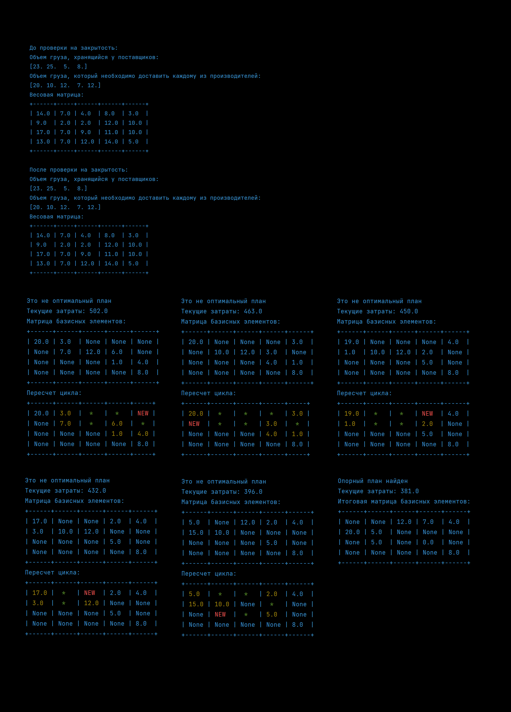
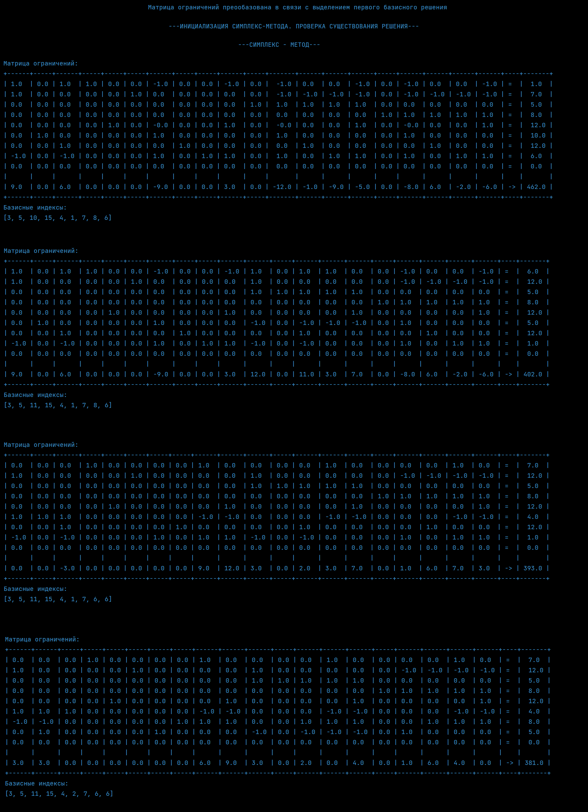
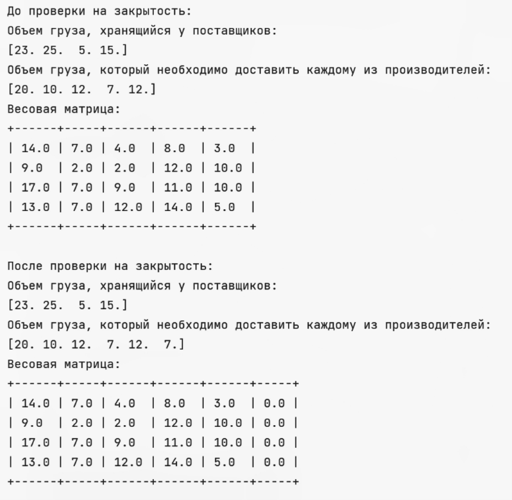
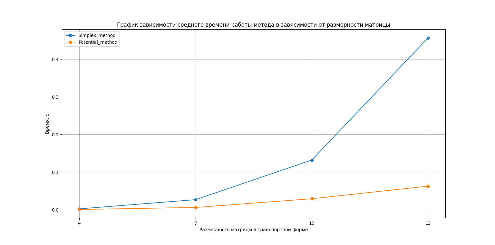
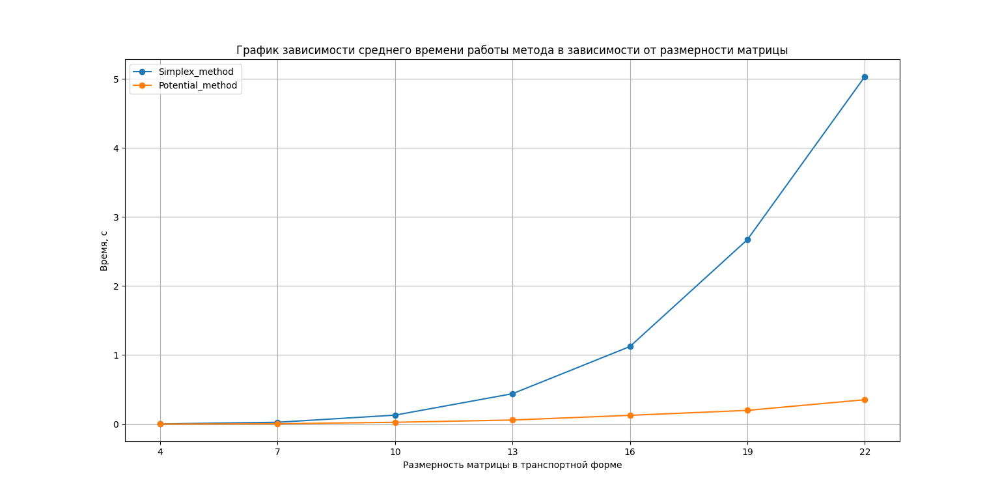

## Solving transport type problems
* [Description](#description)
* [Get started](#get-started)
* [Project structure](#project-structure)
* [Results](#results)


### Description
Solve the problem of transport type. Given: n storage points, where the same kind of cargo is concentrated; m destination points, to which the cargo must be delivered. 

Necessary:
1. Solve the transport problem by the method of potentials with the choice of the initial approximation by the northwest corner method.
2. Solve the same problem by the simplex method and compare the results.
3. Solve the same problem by brute force.
4. Automate the ghosting of the original problem to the closed form.
5. Describe the algorithm for building a recalculation loop.
### Get started
```bash
git clone https://github.com/IMZolin/simplex-corner-points <your project name>
cd <your project name>
pip install -r requirements.txt
```

### Project structure
```bash
├───images            # images: console, schema, graphics
├───report
│   └───lab2_opt_methods.pdf 
└───src                 # code
    ├───check_optimum.py # check optimum: function for potentials method
    ├───corner_dots.py  # corner dots method
    ├───dual.py         # convert direct to dual
    ├───import_adapter.py # import task from dile
    ├───input.txt       # task on file
    ├───interface_file.py # output: results in the console
    ├───linear_programming.py # linear programming class 
    ├───loop_recalculation_file.py # loop recalculation: function for potentials method
    ├───main.py         # test potential method
    ├───north_west_method.py # north west method: search for a optimum plan
    ├───open_to_close.py # convert close task to open (to solve transport problem)
    ├───potential_method.py 
    ├───preprocessing.py # convert to canon form and support methods
    ├───reculculation_basis_matrix.py
    ├───result_analisys.py # output: graphics
    ├───simplex.py      # simplex method
    ├───simplex_executable.py # test simplex method
    ├───SLAU_optimization_method.py # solve SLAU
    ├───tp_convert_to_lpp.py # convert transport problem to linear programming problem
    ├───tp_corner_dots.py # test corner dots
    └───transport_problem.py #trasnport problem class
```

### Results

#### Console results
1. Potentials method

2. Simplex method

3. Convert open task to close


#### Graphic results
Graphics dependencies of the average running time of the methods on the dimensionality of the matrix
1. Matrix dimensions: 4-13

2. Matrix dimensions: 4-22



  

